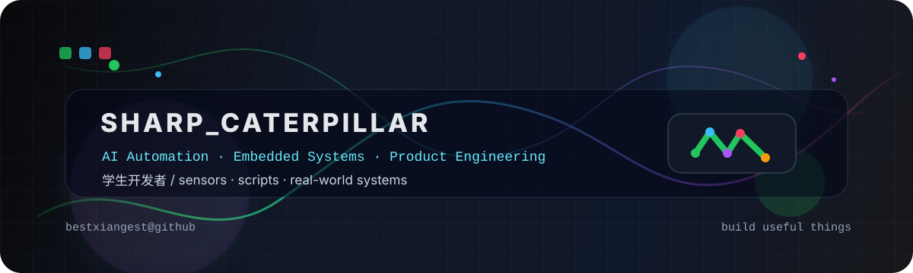
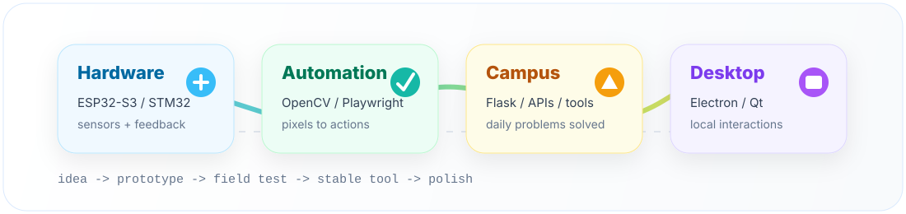
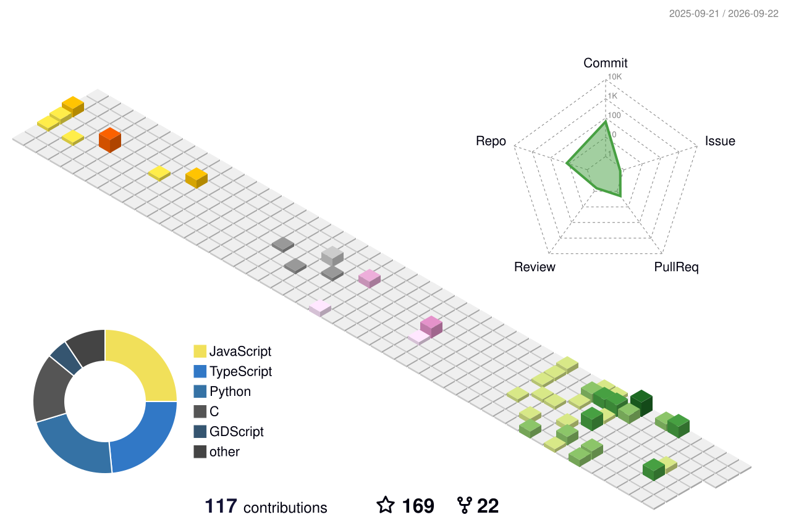

<p align="center">
  
</p>

<h1 align="center">bestxiangest / sharp_caterpillar</h1>

<p align="center">
  <a href="https://readme-typing-svg.demolab.com">
    
  </a>
</p>

<p align="center">
  <a href="https://github.com/bestxiangest?tab=followers">
    
  </a>
  <a href="https://github.com/bestxiangest?tab=repositories">
    
  </a>
  
  
  <a href="https://github.com/bestxiangest/bestxiangest/actions/workflows/generate-snake.yml">
    
  </a>
</p>

<p align="center">
  <b>学生开发者，喜欢把自动化、硬件、视觉识别和校园场景揉成能跑起来的小系统。</b>
</p>

<p align="center">
  
</p>

---

## Workbench

<table>
  <tr>
    <td width="25%" valign="top">
      <h3>Hardware</h3>
      <p>ESP32-S3、STM32、传感器、液位监测、语音交互，把代码接到真实世界。</p>
    </td>
    <td width="25%" valign="top">
      <h3>Automation</h3>
      <p>Playwright、OpenCV、脚本编排、屏幕状态识别，减少重复操作和注意力消耗。</p>
    </td>
    <td width="25%" valign="top">
      <h3>Campus Tools</h3>
      <p>校园网登录、成绩分析、二手交易、实验室屏幕，让身边问题有可用解法。</p>
    </td>
    <td width="25%" valign="top">
      <h3>Desktop UX</h3>
      <p>Electron、Qt、实时通信和本地交互，把小工具做得更顺手。</p>
    </td>
  </tr>
</table>

<p align="center">
  
</p>

<p align="center">
  
  
  
  
  
</p>

## Field Notes

<p align="center">
  <a href="https://github.com/bestxiangest/Intelligent-Guide-Cane">
    
  </a>
  <a href="https://github.com/bestxiangest/DeltaForce-Auto-Purchase">
    
  </a>
</p>

<p align="center">
  <a href="https://github.com/bestxiangest/Goods-Trading-Center">
    
  </a>
  <a href="https://github.com/bestxiangest/clawd-buddy">
    
  </a>
</p>

| Project | Signal | Notes |
| --- | --- | --- |
| [Intelligent-Guide-Cane](https://github.com/bestxiangest/Intelligent-Guide-Cane) | `ESP32-S3` `C` `AI perception` | 多模态智能导盲系统，串起传感器、环境识别、语音交互和出行辅助。 |
| [DeltaForce-Auto-Purchase](https://github.com/bestxiangest/DeltaForce-Auto-Purchase) | `Python` `OpenCV` `automation` | 用视觉识别理解屏幕状态，再把高频操作变成自动流程。 |
| [Goods-Trading-Center](https://github.com/bestxiangest/Goods-Trading-Center) | `Flask` `REST API` `campus` | 校园二手交易后端，覆盖用户、物品、交易、评价和消息链路。 |
| [clawd-buddy](https://github.com/bestxiangest/clawd-buddy) | `Electron` `JavaScript` `desktop` | 本地桌面陪伴应用，包含行为循环、鼠标交互和动画状态管理。 |
| [ECJTUCampusNetwork-AutoLogin](https://github.com/bestxiangest/ECJTUCampusNetwork-AutoLogin) | `Python` `network` | 校园网认证自动化，解决每天重复登录的问题。 |
| [HelloChatRoom](https://github.com/bestxiangest/HelloChatRoom) | `C++` `Qt` `SocketIO` | 实时聊天室，支持消息、文件传输和 AI 对话能力。 |

## Contribution Playground

<p align="center">
  
</p>

<p align="center">
  <picture>
    <source media="(prefers-color-scheme: dark)" srcset="https://raw.githubusercontent.com/bestxiangest/bestxiangest/output/github-contribution-grid-snake-dark.svg" />
    <source media="(prefers-color-scheme: light)" srcset="https://raw.githubusercontent.com/bestxiangest/bestxiangest/output/github-contribution-grid-snake.svg" />
    
  </picture>
</p>

<p align="center">
  
  
</p>

<p align="center">
  
  
</p>

<p align="center">
  
</p>

<p align="center">
  
</p>

## Tiny Lab Log

```text
sensor input       -> clean signal      -> useful feedback
screen pixels      -> state detection   -> automation flow
campus problem     -> API + UI          -> product loop
small prototype    -> test in context   -> stable tool
```

<details>
  <summary>Open tabs on my workbench</summary>
  <br />
  <p>
    <a href="https://github.com/bestxiangest/AnyrouterLogin"></a>
    <a href="https://github.com/bestxiangest/Automated-File-Organizer"></a>
    <a href="https://github.com/bestxiangest/ECJTU_AI"></a>
    <a href="https://github.com/bestxiangest/SmartScreen"></a>
    <a href="https://github.com/bestxiangest/Qt-Calendar"></a>
    <a href="https://github.com/bestxiangest/Intelligent-infusion-alarm-system"></a>
  </p>
</details>

<p align="center">
  <a href="https://github.com/bestxiangest?tab=repositories">
    
  </a>
  <a href="https://github.com/bestxiangest/Intelligent-Guide-Cane">
    
  </a>
</p>
