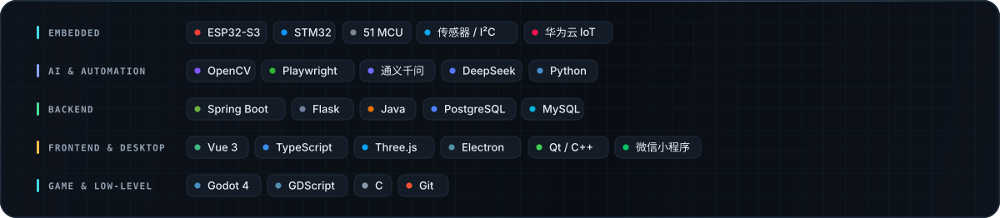
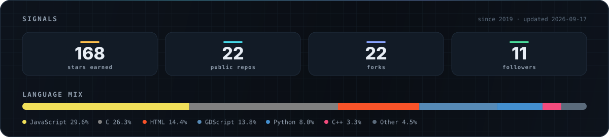
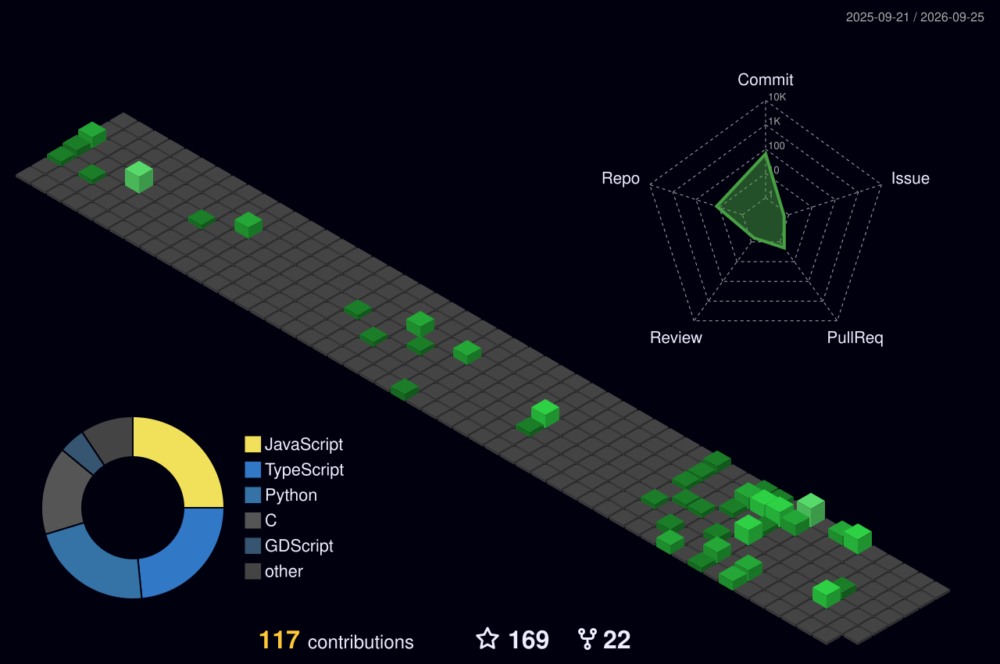

<picture>
  <source media="(prefers-color-scheme: dark)" srcset="assets/hero-dark.svg">
  <source media="(prefers-color-scheme: light)" srcset="assets/hero-light.svg">
  
</picture>

  

## 关于

华东交通大学在读。做东西的路子基本固定下来了：先撞上一个真实存在的麻烦，做个能跑的原型验证想法，再回头补稳定性和边界情况。仓库里这些项目大多是这么长出来的，不是先挑技术再找题目。

- **嵌入式 + 感知** — 在 ESP32-S3 / STM32 上做传感器融合和视觉识别，让硬件读懂物理世界。
- **AI 自动化** — 用视觉模型理解屏幕和图像状态，把重复的、拼反应速度的操作交给脚本。
- **全栈工具** — Spring Boot / Flask 配 Vue 3，把身边的具体问题做成真的能用的系统。
- **业余试手** — Godot 4 像素肉鸽、Three.js 浏览器 FPS、Electron 桌面宠物，拿来练新技术栈。

## 代表作品

<table>
<tr>
<td width="50%" valign="top">

#### [DeltaForce-Auto-Purchase](https://github.com/bestxiangest/DeltaForce-Auto-Purchase) 

实时读屏加模板匹配，把《三角洲行动》里限时上架物品的抢购变成自动流程，替掉纯靠反应速度的手动操作。目前 star 最多的一个。

`Python` `OpenCV` `计算机视觉`

</td>
<td width="50%" valign="top">

#### [星辰引路者 · Intelligent-Guide-Cane](https://github.com/bestxiangest/Intelligent-Guide-Cane) 

ESP32-S3 多模态导盲系统。识别障碍物、盲道与红绿灯，用语音播报导航结果和天气查询，把视障出行的风险压下来。

`ESP32-S3` `C` `多模态感知` `语音交互`

</td>
</tr>
<tr>
<td width="50%" valign="top">

#### [teamsync](https://github.com/bestxiangest/teamsync) 

团队协作与项目推进系统。看板任务、周期计划、日历视图、活动流、站内通知和邮件提醒都打通了，是目前完整度最高的全栈项目。

`Spring Boot` `Vue 3` `PostgreSQL`

</td>
<td width="50%" valign="top">

#### [pi-vision-bridge](https://github.com/bestxiangest/pi-vision-bridge) 

给纯文本模型接上眼睛。让 DeepSeek 这类模型按当前任务主动调用视觉模型，从截图、图表和文档里取回结构化证据再继续推理。

`TypeScript` `多模态` `Agent 插件`

</td>
</tr>
<tr>
<td width="50%" valign="top">

#### [叠镇 · rouge](https://github.com/bestxiangest/rouge) 

Godot 4 写的像素城镇射击肉鸽，元气骑士式的房间清怪。浏览器直接开：**[rouge.lovezzn.com](https://rouge.lovezzn.com)**

`Godot 4` `GDScript` `关卡设计`

</td>
<td width="50%" valign="top">

#### [clawd-buddy](https://github.com/bestxiangest/clawd-buddy) 

Electron 桌面宠物，不依赖任何外部 AI 服务独立运行。鼠标跟随、睡眠循环、自主行为，加一整套交互动画。

`Electron` `JavaScript` `桌面应用`

</td>
</tr>
</table>

## 工具箱

<picture>
  <source media="(prefers-color-scheme: dark)" srcset="assets/stack-dark.svg">
  <source media="(prefers-color-scheme: light)" srcset="assets/stack-light.svg">
  
</picture>

每一项都能在这个账号的公开仓库里找到对应实现，没有列没做过的东西。

## GitHub 数据

<picture>
  <source media="(prefers-color-scheme: dark)" srcset="assets/stats-dark.svg">
  <source media="(prefers-color-scheme: light)" srcset="assets/stats-light.svg">
  
</picture>

由 <a href="scripts/build_assets.py">scripts/build_assets.py</a> 每天从 GitHub API 拉数据后重绘，不依赖第三方 badge 服务，也就不会跟着别人的服务一起挂。

<b>贡献图动画</b>

 

<picture>
  <source media="(prefers-color-scheme: dark)" srcset="https://raw.githubusercontent.com/bestxiangest/bestxiangest/output/github-contribution-grid-snake-dark.svg">
  <source media="(prefers-color-scheme: light)" srcset="https://raw.githubusercontent.com/bestxiangest/bestxiangest/output/github-contribution-grid-snake.svg">
  
</picture>

<picture>
  <source media="(prefers-color-scheme: dark)" srcset="profile-3d-contrib/profile-night-green.svg">
  <source media="(prefers-color-scheme: light)" srcset="profile-3d-contrib/profile-green.svg">
  
</picture>

<b>更多项目</b> — 按方向分类

 

**嵌入式 / 硬件**

- [Intelligent-infusion-alarm-system](https://github.com/bestxiangest/Intelligent-infusion-alarm-system) — 输液液位监测与异常报警，硬件端、接收端、后端和微信小程序走通全链路，数据上华为云 IoT
- [IntelligentTrackingCar-STM32](https://github.com/bestxiangest/IntelligentTrackingCar-STM32) — STM32 灰度传感器循迹小车，开环控制
- [electricFan](https://github.com/bestxiangest/electricFan) — 51 单片机可调速风扇，带遥控

**校园工具**

- [Goods-Trading-Center](https://github.com/bestxiangest/Goods-Trading-Center) — CampusEcho 校园二手交易，覆盖交易、评价、消息、举报治理与争议仲裁
- [ECJTU_AI](https://github.com/bestxiangest/ECJTU_AI) — 成绩查询与分析，接通义千问做趋势预测和学习建议
- [ECJTUCampusNetwork-AutoLogin](https://github.com/bestxiangest/ECJTUCampusNetwork-AutoLogin) — 校园网 Eportal 自动认证，省掉每天手动登录
- [SmartScreen](https://github.com/bestxiangest/SmartScreen) — Flask 智慧实验室电子班牌：考勤、设备、环境监测、公告发布

**自动化脚本**

- [AnyrouterLogin](https://github.com/bestxiangest/AnyrouterLogin) — Playwright 多账号登录与签到，用 Excel 管理账号和执行状态
- [Automated-File-Organizer](https://github.com/bestxiangest/Automated-File-Organizer) — 按文件类型自动归类，GUI 和 CLI 双模式
- [PatentsDownloaderWeb](https://github.com/bestxiangest/PatentsDownloaderWeb) — 专利批量下载

**桌面 / 游戏**

- [Qt-Calendar](https://github.com/bestxiangest/Qt-Calendar) — Qt C++ 日历，含日程管理与天气预报
- [HelloChatRoom](https://github.com/bestxiangest/HelloChatRoom) — Qt + Flask-SocketIO 实时聊天室，支持文件传输和 AI 对话
- [pixel-fps](https://github.com/bestxiangest/pixel-fps) — Vite + Three.js 浏览器像素 FPS

---

  <a href="https://github.com/bestxiangest?tab=repositories">全部仓库</a> &nbsp;·&nbsp;
  <a href="https://bestxiangest.github.io/profile/">作品集</a> &nbsp;·&nbsp;
  <a href="https://rouge.lovezzn.com">叠镇 · 在线试玩</a>

 

